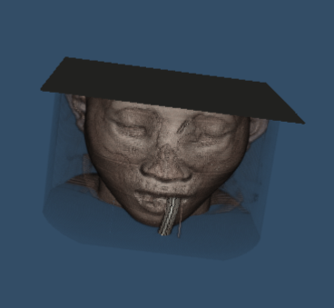
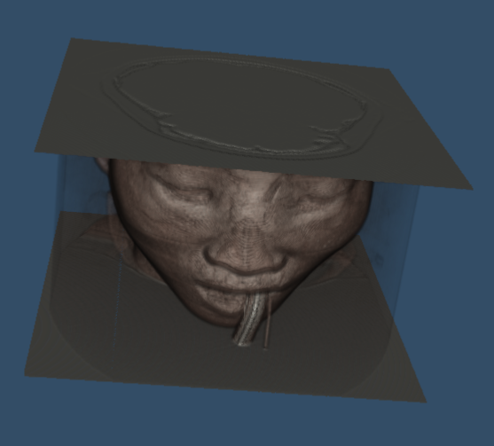
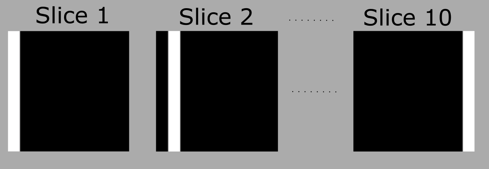
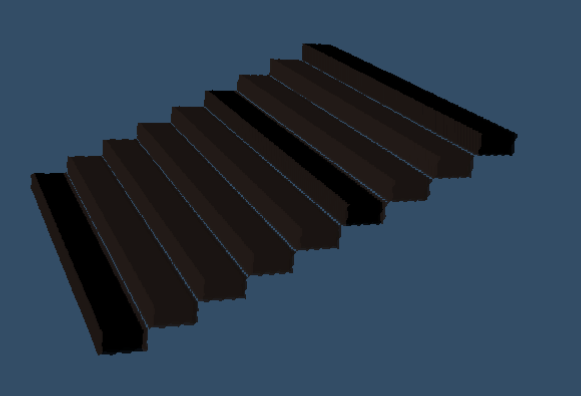
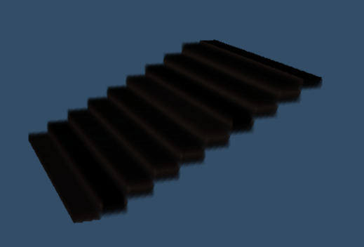

# vtk-volume-render-bounds-bug
Volume rendering code to debug first and last slice rendering

## Full head

### Nearest neighbor interpolation

### Linear interpolation

## Test dicom

### Test DICOM Nearest neighbor interpolation 
shows only 9 bars

### Test DICOM Linear interpolation
shows 10 bars but the thickness of the bar in the first and last is not consistent with the rest

